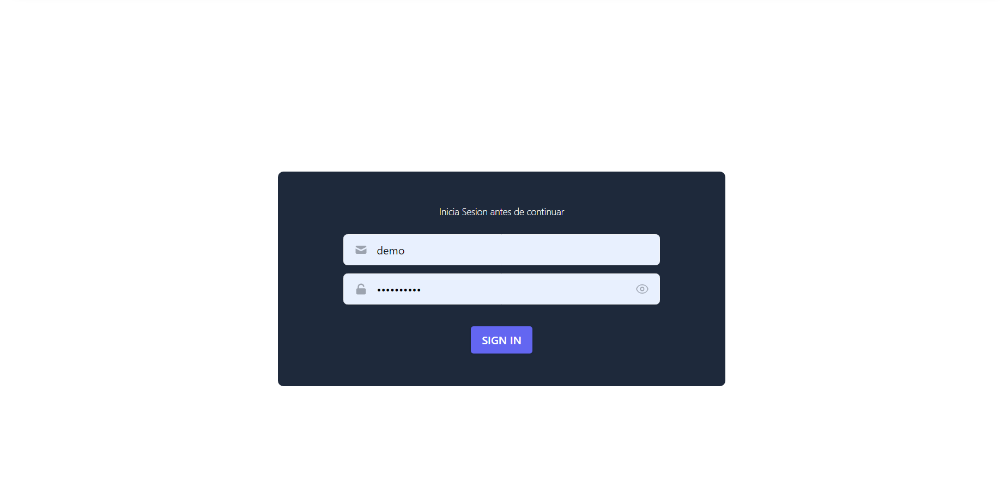
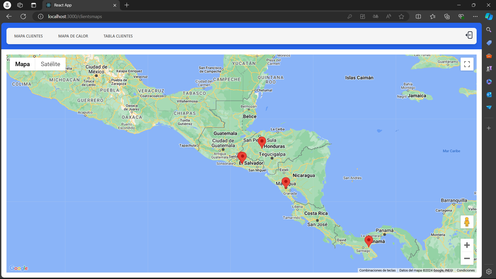
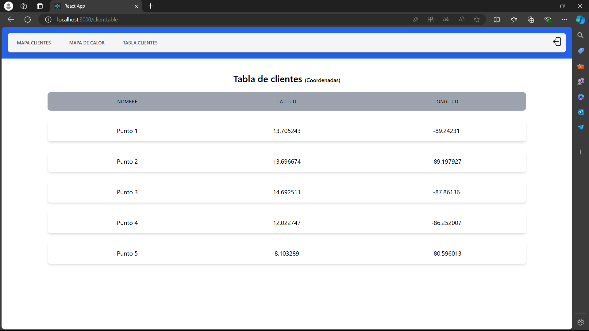
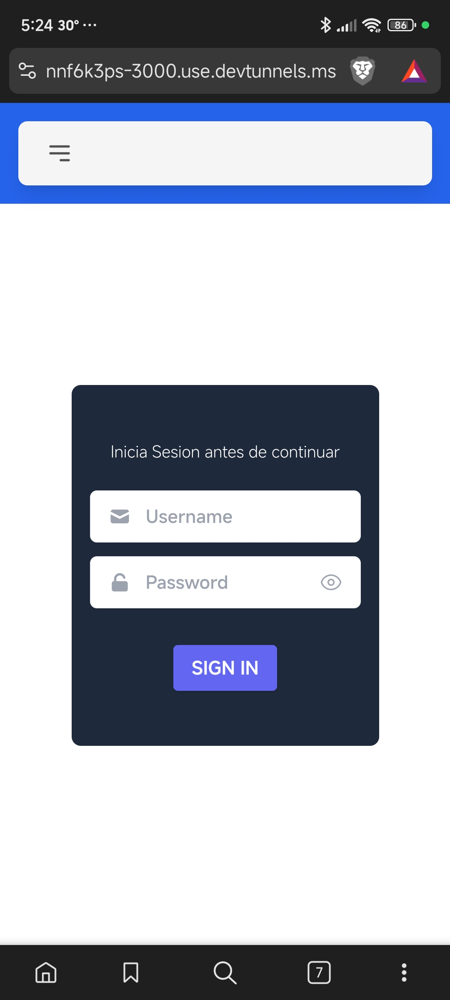
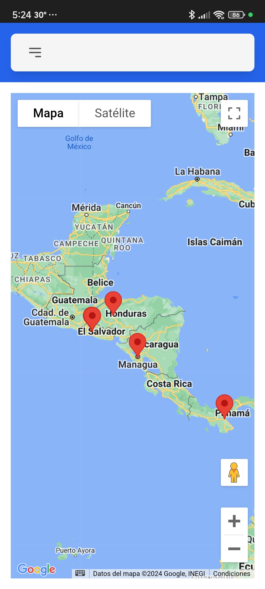
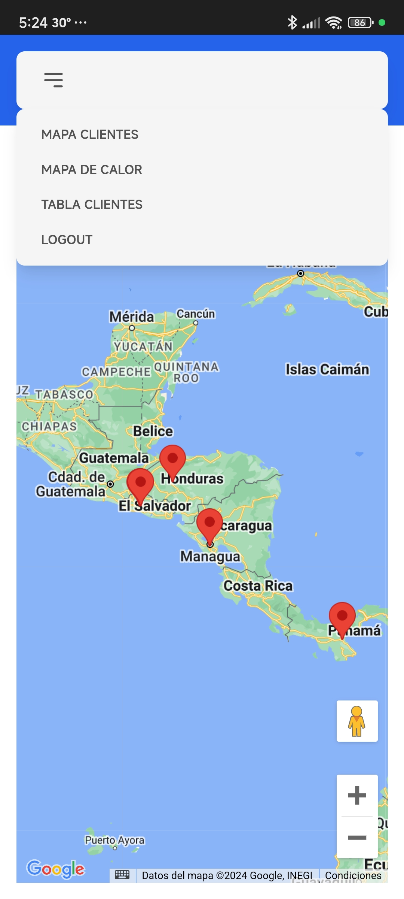
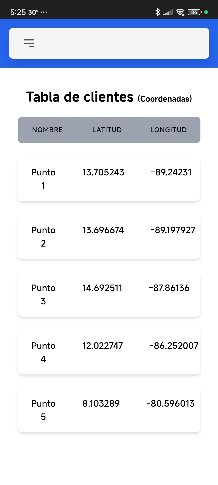

# Prueba tecnica Carossi

En el siguiente proyecto se implemento la prueba tecnica solicitada para la plaza de desarrollador Full Stack, he utilizado unicamente React y las librerias que proporcionaron en el Form.

# Login View

# ClientsMap

# Clients Table

# Login View (Mobile)

# Clients Map (Mobile)

# Navbar (Mobile)

# Clients Table (Mobile)

